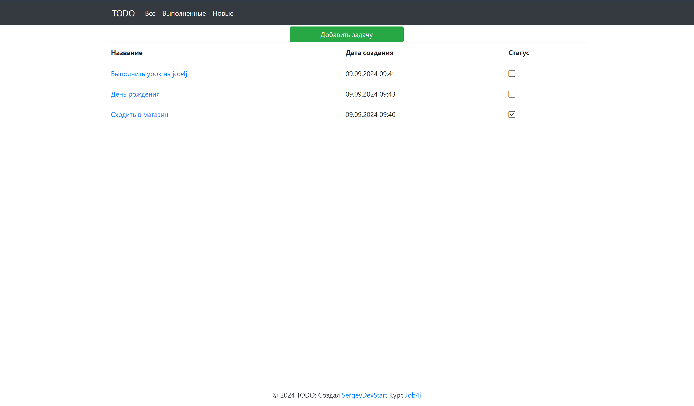
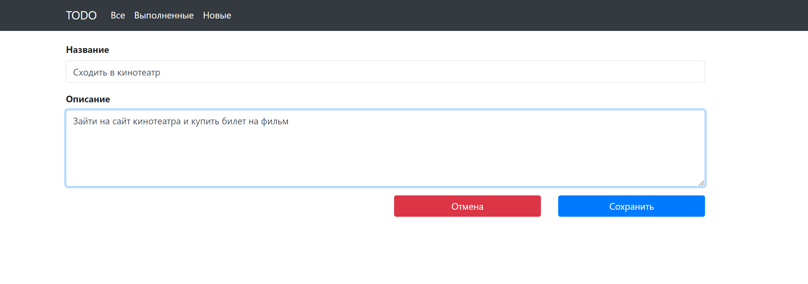
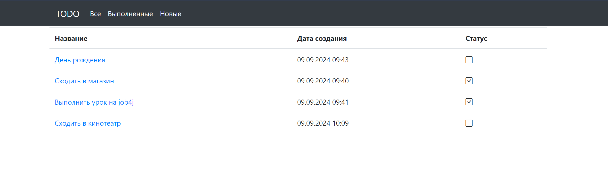
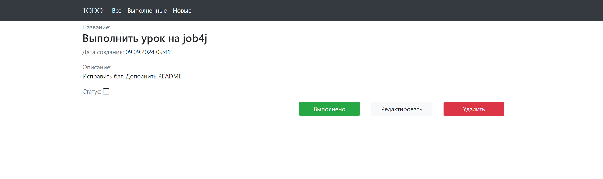
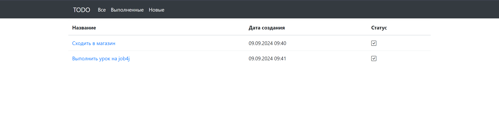
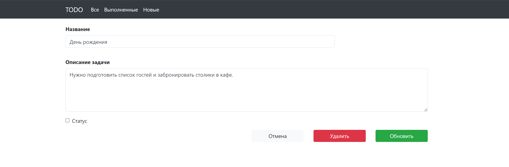

# job4j_todo

## Описание проекта
job4j_todo — это учебный проект, который представляет собой просто список дел.
Пользователь может создавать/ редактировать задачи. Все записи сохраняются в базу данных.  

## Используемые технологии в проекте:
- Spring boot
- Thymeleaf
- Bootstrap
- PostgreSQL
- hibernate
- Liquibase 

### Требования к окружению:
- Java 17
- Maven 3.9.3
- PostgreSQL 14

## Запуск проекта:
1. Создайте базу данных PostgreSQL:
    ```sql
    CREATE DATABASE todo_db;
    ```
2. Склонируйте репозиторий:
    ```bash
    git clone https://github.com/SergeyDevStart/job4j_todo
    cd job4j_todo
    ```

3. Соберите проект с помощью Maven:
    ```bash
    mvn clean install
    ```

4. Запустите приложение:
    ```bash
    mvn spring-boot:run
    ```

После успешного запуска приложение будет доступно по адресу: [http://localhost:8080](http://localhost:8080)

## Взаимодействие с приложением:

#### Список всех задач


#### Страница создания задачи


#### После создания, задача появляется в списке новых


#### Страница с подробным описанием задачи


#### Если нажали на кнопку выполнить, то задание переводится в состояние выполнено


#### Кнопка "Редактировать" переводит пользователя на отдельную страницу для редактирования


## Контакты

